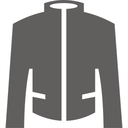

# Jackett via OpenVPN

Jackett Home Assistant add-on tunneling via OpenVPN

# How to use this add-on

Install the add-on, choose your desired port, set options, start.

After the add-on is started proceed to: https://[ip]:[port] and follow the setup process.
